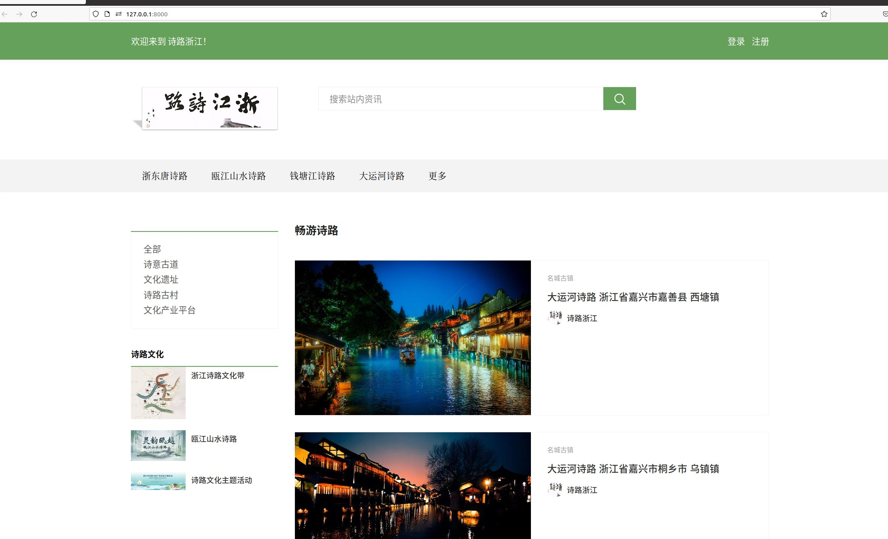
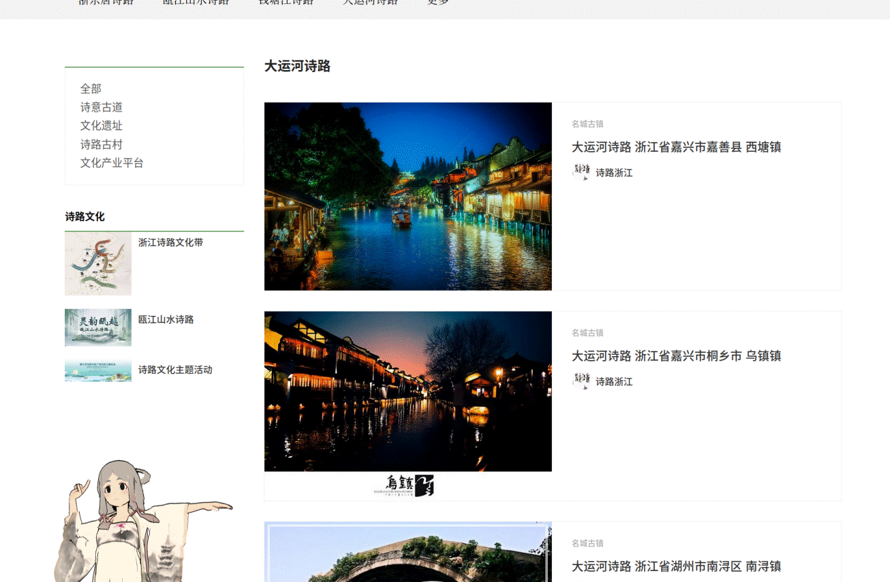
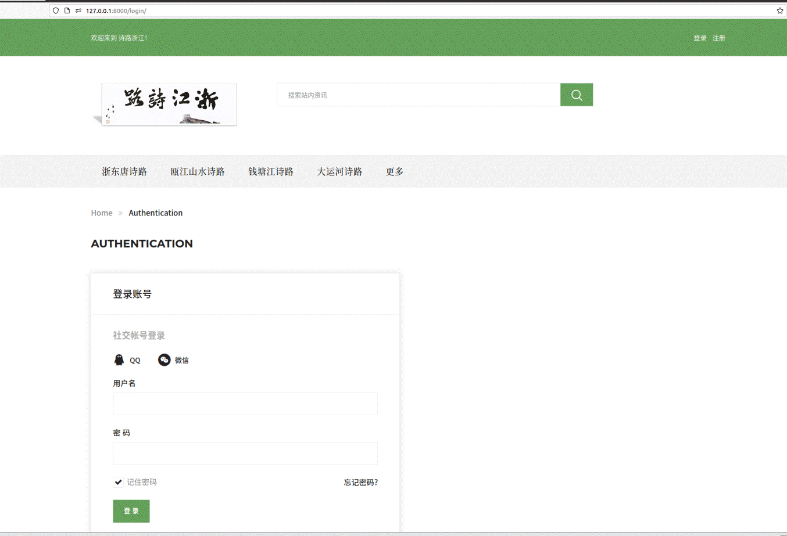
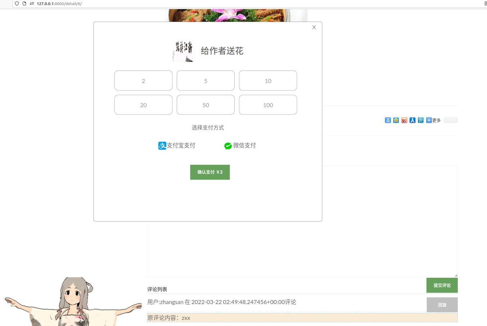
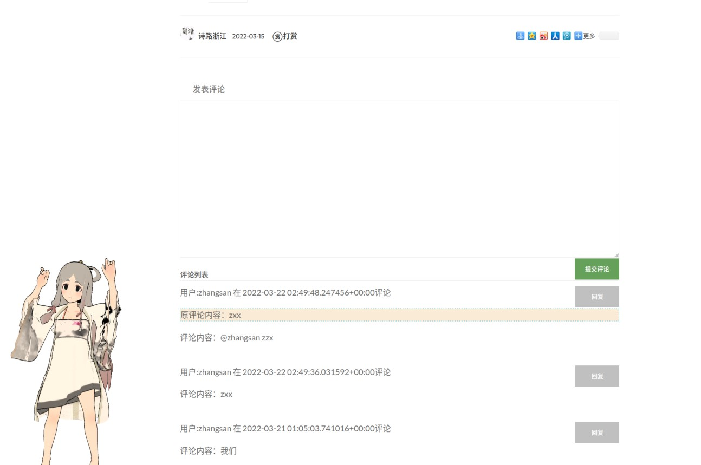
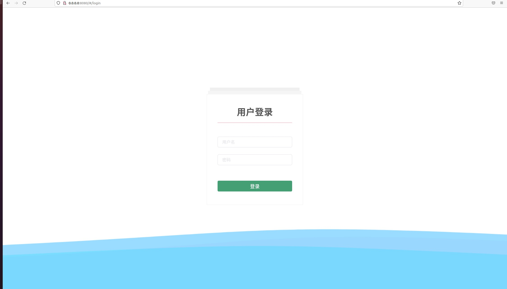
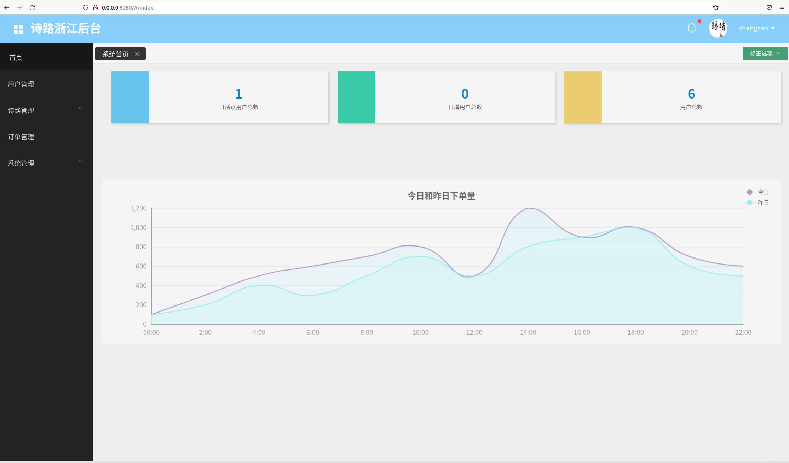
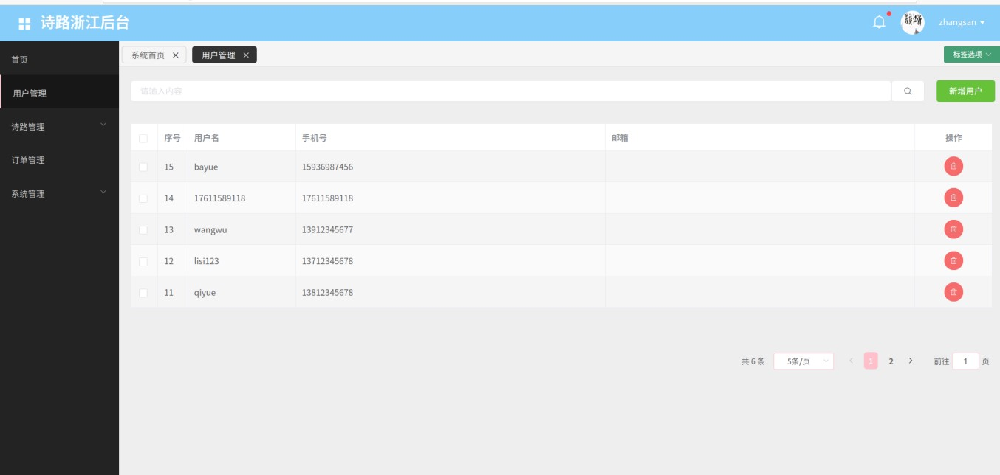
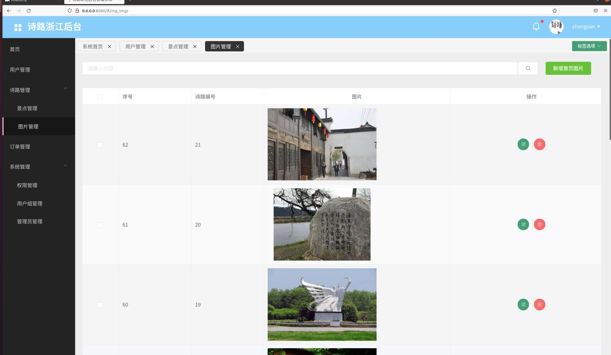
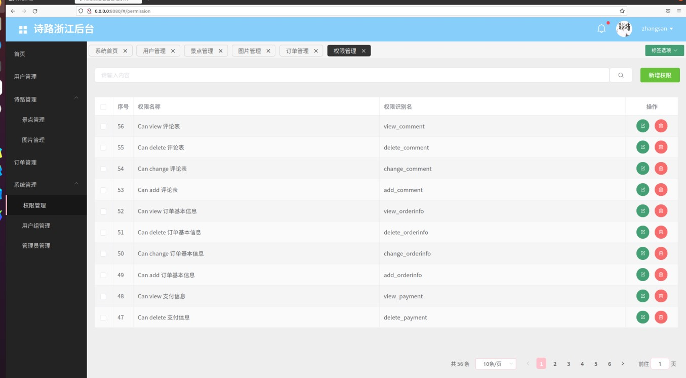

# 浙江诗路信息管理平台和后台监控系统

## 一、项目介绍

#### 1. 项目名称
- 浙江诗路信息管理平台
- 浙江诗路后台监控系统

#### 2. 项目功能
- 信息管理平台
  - 用户注册登录（短信验证，图形码验证）
  - 用户中心
  - 信息发布，评论，点赞，打赏，收藏，检索，概览，分类
- 后台监控系统
  - 管理员登录
  - 图片，用户，权限，角色，信息，评论，点赞，操作日志管理
  - 图表统计

#### 3. 项目简介
- 前端：vue2 + element-ui + axios + vue-cli3 + jinja2 + echarts + three.js
- 后端：django全家桶2.2.0 + mysql + redis + nginx + uwsgi + python3.6+ 
- 项目管理：pip
- 项目部署：nginx + uwsgi + docker
- 项目版本管理：Git
- 项目协作：Github

#### 4. 项目特点
**项目全程在ubuntu20.4系统进行开发，了解并掌握了Linux操作系统**
#####  前端
###### 前台信息展示主要是前后端不分离的项目，主要使用jinja2模板引擎进行开发
- 采用jinja2模板引擎进行页面渲染
- 采用vue.js进行页面交互
- 采用axios进行数据请求
- 嵌入three.js进行3D效果展示 
###### 后台监控管理系统主要使用vue2系列进行开发
- 采用vue-cli3脚手架搭建项目 主要使用vue2
- 采用axios进行数据请求
- 采用element-ui进行页面布局
- 采用vue-router进行路由管理
- 采用vuex进行状态管理

#####  后端
- 采用django全家桶进行开发 django2.2.0 + django-rest-framework  + django-filter
- 采用mysql进行数据存储 django自带orm进行数据操作
- 采用redis进行缓存 django-redis进行缓存管理
- 采用celery进行异步任务管理
- 采用fastdfs进行文件存储 docker部署
- 采用elasticsearch进行全文检索 docker部署
- 采用短信接口进行短信验证
- 采用定时任务 celery beat进行定时任务管理

## 二、项目演示
**由于短信接口收费，就不放演示地址了** 
- 首页 
- 信息展示 
- 登录 
- 打赏 
- 评论 
- 后台登录 
- 后台概览 
- 后台用户管理 
- 后台诗路管理 
- 后台权限管理 

## 三、项目启动
### 前端（后台管理）
#### 本地启动
1. 安装node.js >=14
2. 安装vue-cli3
3. 安装依赖
```
npm install
npm run dev
```
#### 部署
1. 安装nginx
2. 安装node.js >=14
3. 使用命令打包 将打包好的dist文件夹放到nginx的html目录下 进行相关配置即可
```
npm run build
```

### 后端
#### 本地启动
1. 安装python >=3.6
2. 将requirements.txt中的依赖安装到虚拟环境中 进行相关配置
3. 配置好mysql, redis, 短信接口
4. 配置好docker里的fastdfs和elasticsearch
```
pip install -r requirements.txt
python manager.py runserver
```
#### 部署
1. 安装python >=3.6 最好创建虚拟环境
2. 安装nginx
3. 安装mysql, redis
4. 将requirements.txt中的依赖安装到虚拟环境中 其中包含uwsgi
5. 配置好docker里的fastdfs和elasticsearch
6. 修改config.py中的配置 并配置nginx uwsgi 启动即可
```
pip install -r requirements.txt
uwsgi --ini uwsgi.ini
```